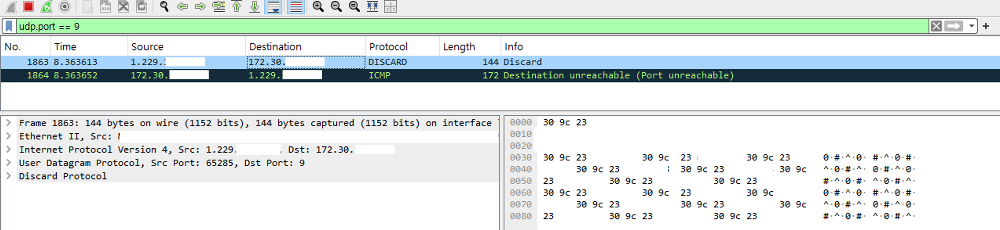

# WOLPacketSender
**Wake-On-LAN (WOL) 패킷 전송기**

## 소개
WOLPacketSender는 네트워크 내의 컴퓨터를 원격으로 깨우기 위한 다양한 방법을 제공하는 도구 모음입니다. 이 프로젝트는 Python 스크립트와 쉘 스크립트를 포함하여 여러 가지 방식으로 WOL 매직 패킷을 전송할 수 있습니다.


## 설치
```bash
git clone https://github.com/andsopwn/WOLPacketSender.git
cd WOLPacketSender
```

## Magic


``` bash
Wake-On-LAN 매직 패킷 전송을 시작합니다...
WOL 패킷 전송 성공: 30:9C:23:XX:XX:XX -> XX.XX.XX.XX:9
모든 WOL 패킷 전송이 완료되었습니다.
```